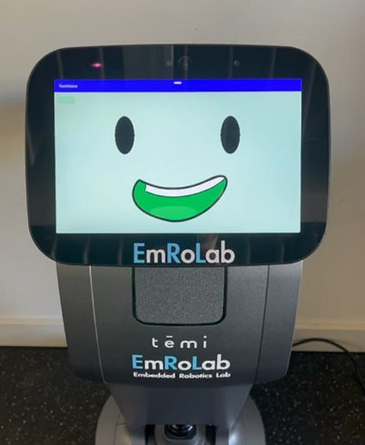
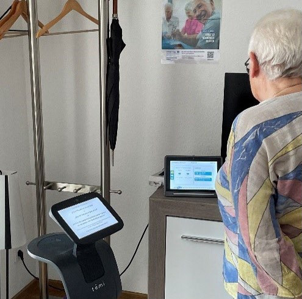

# Temi Voice App

Android application for the [Temi](https://www.robotemi.com/) service robot, built for **VOICE — Nutzen- und Akzeptanzstudie von Sprachassistenten für AAL-Anwendungen** ("Benefit and Acceptance Study of Voice Assistants for Ambient Assisted Living Applications"), a research project at [htw saar](https://www.htwsaar.de/).



## About the VOICE project

Demographic change is driving demand for technology-based assistance systems that let people live independently at home for longer, or that support caregiving. The VOICE project investigates how various voice assistant systems are used and accepted by older adults.

Selected study participants visit the AAL-Netzwerk Saar's furnished demonstration apartment, where everyday assistive technologies are presented for people of different ages and life situations. The Temi service robot (developed by [EmRoLab](https://www.htwsaar.de/), the Embedded Robotics Lab at htw saar) plays a central role: it guides participants through the study, explains each step, and presents the everyday assistants integrated into the demonstration kitchen. Through direct voice interaction with Temi and the other voice assistants, participants actively shape the course of the study.


*A study participant interacting with Temi and a second voice assistant during a session.*

**Goal:** contribute to current research on what needs to be considered when developing voice assistants for older adults, and whether such assistants can genuinely simplify daily life — in particular, working out a validation strategy that properly accounts for effect, utility, acceptance, and data transparency.

**Origin:** developed as an interdisciplinary project under htw saar's cooperative initial funding, bringing together researchers from nursing science, systems neuroscience and neurotechnology, and electrical engineering.

**Lead researchers:** Prof. Dr. Dagmar Renaud, Prof. Dr. Dr. Daniel J. Strauss, Prof. Dr. Martin Buchholz.

*Source: [htw saar Messekatalog know-how 2025](https://saaris.de/wp-content/uploads/2025/05/Messekatalog_knowhow_2025.pdf), VOICE project entry.*

### Why voice technology matters for care

Voice assistants act as a bridge for people with limited mobility. Instead of pressing buttons on a screen, users can simply talk to the device to turn on lights, make phone calls, or set medication reminders. The VOICE project examines whether people actually like using these tools, whether they find them easy to talk to, and whether they trust the technology with their data.

## About this app

Temi Voice is the application running on the robot during study sessions. It uses Temi's built-in transcription to recognize spoken commands and trigger the tasks that make up a session: guiding participants through the demonstration apartment, running structured survey interviews, and playing memory/trivia games — all driven by voice, in German.

### Features

- [x] **User interface** for on-screen interaction alongside voice control
- [x] **Transcription capture** — extracts and acts on Temi's speech-to-text output
- [x] **Voice-command navigation** — sends Temi to saved locations (e.g. `tür`, `küche`, `wohnzimmer`, `waschbecken`, `alexa`) on spoken commands like *"gehe"* / *"fahre"*
- [x] **Guided sequences** — multi-step spoken sequences for greeting guests, an AAL apartment tour, a kitchen walkthrough, and an Alexa interaction demo
- [x] **Structured surveys** — a 16-question voice-driven interview sequence, with responses logged
- [x] **Interactive games** — a memory game ("Gedächtnisspiel") and trivia questions, triggered by voice
- [x] **Reminders** — participants can ask Temi to set a reminder ("erinnere mich")
- [ ] **Video calls** — placing video calls to contacts (planned)

## Getting Started

### Prerequisites

- Temi Robot v2
- Android Debug Bridge (ADB) installed on your computer or directly in Android Studio

### Installation

Ensure your Temi robot is connected to the same network as your computer.

### Using ADB to Upload the APK to Temi

ADB (Android Debug Bridge) is a versatile command-line tool that lets you communicate with a device. You can use ADB to install the Temi Voice APK on your Temi robot over a network connection.

#### Steps to Install APK using ADB

1. **Install ADB on Windows**:
   - Download SDK Platform-Tools for Windows and extract the downloaded zip file.
   - Within the extracted folder, press SHIFT and right-click to display the context menu. Select "Open PowerShell window here" (or "Open command window here" on some computers) to open a command prompt.

2. **Enable ADB Port on Temi Robot**:
   - On the Temi robot, select `Settings > Developer Tools` and tap `Open Port`.
   - Take note of the robot's IP address displayed on the screen.

3. **Test ADB**:
   - Connect your PC (with the installation of ADB) to the same network as the robot.
   - Type the following command into the command prompt:
     ```bash
     adb connect <robot-ip-address>
     ```
   - If everything goes well, you should see `connected to <robot-ip-address>`.

4. **Install the APK**:
    ```bash
    adb install path/to/temi-voice-apk.apk
    ```
   - You can also just build and run the app when the device `rockchip rk3288` is chosen in Android Studio after successful connection to the device.

5. **Launch the App**:
   Once the APK is installed, you can launch it from the Temi interface or via ADB:
    ```bash
    adb shell am start -n com.yourpackage.temivoiceapk/.MainActivity
    ```

### Pulling Log Files from Temi

To pull the log files created by the app from Temi, use the following ADB command:
   ```bash
   adb pull /data/data/com.example.temi_voice/files/
   ```

### Deleting Log Files from Temi

To delete the log files from Temi, use the following ADB command:
   ```bash
   adb shell rm /data/data/com.example.temi_voice/files/*
   ```

To remove the entire directory and its contents, use the following command:
   ```bash
   adb shell rm -r /data/data/com.example.temi_voice/files/
   ```

## Repository contents

- [`app/src/main/java/com/example/temi_elevator/MainActivity.java`](app/src/main/java/com/example/temi_elevator/MainActivity.java) — voice command routing, navigation, guided sequences, survey and game logic
- [`app/src/main/java/com/example/temi_elevator/Reminder.java`](app/src/main/java/com/example/temi_elevator/Reminder.java) — reminder scheduling
- [`app/src/main/java/com/example/temi_elevator/SequenceActivity.java`](app/src/main/java/com/example/temi_elevator/SequenceActivity.java), [`Settings.java`](app/src/main/java/com/example/temi_elevator/Settings.java) — sequence/activity flow and app settings
- [`app/src/main/res/`](app/src/main/res/) — UI layouts and (German-language) voice/UI strings
- `QR_code_generator.exe` — helper for generating QR codes used during study sessions

## Contact

Developed for the VOICE project at htw saar. For questions about the research study, see the [project entry in the htw saar Messekatalog](https://saaris.de/wp-content/uploads/2025/05/Messekatalog_knowhow_2025.pdf).
